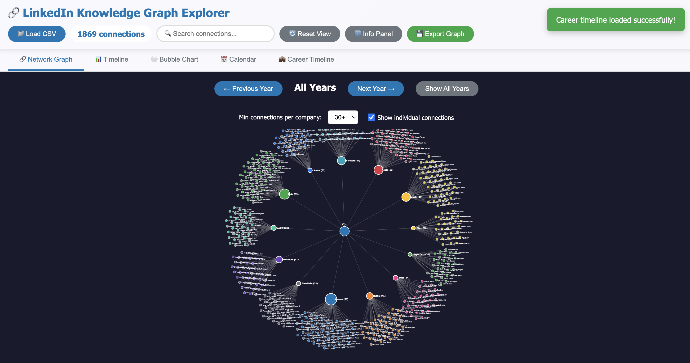
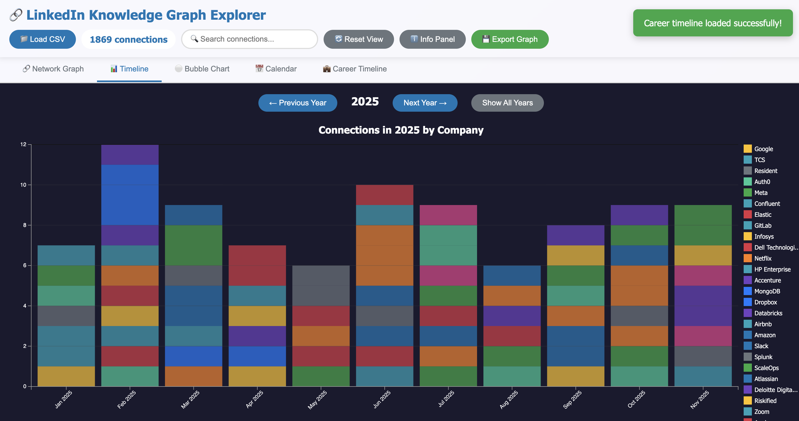
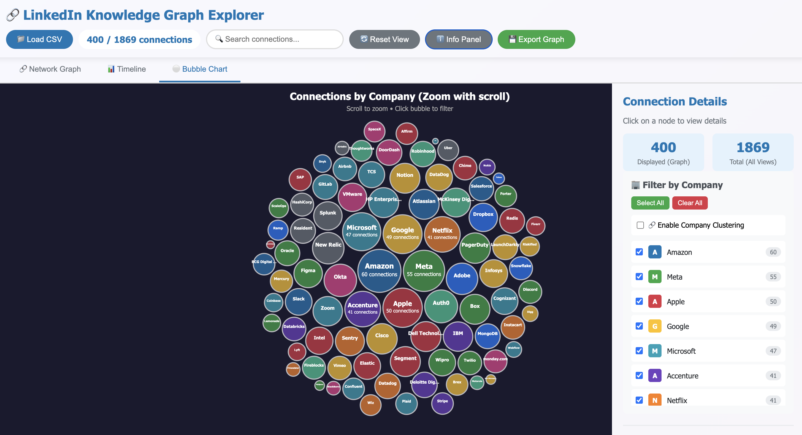
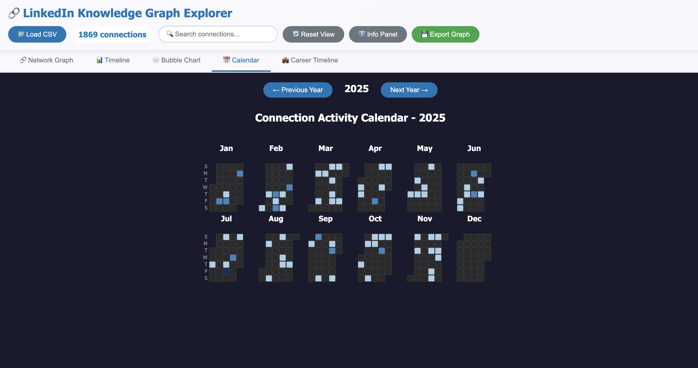
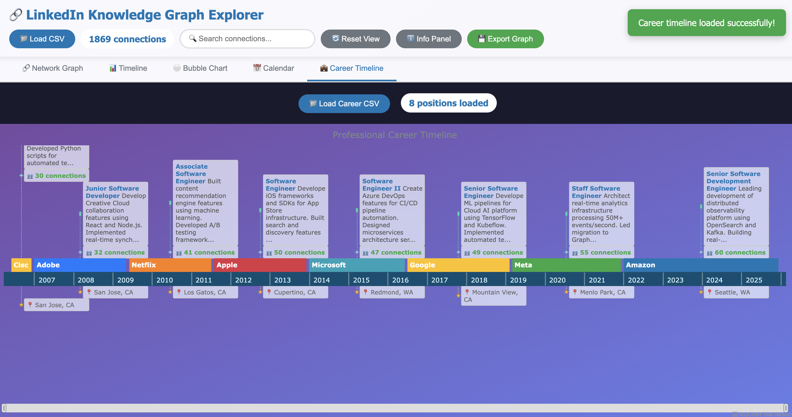

# LinkedIn Knowledge Graph Explorer

A modern, interactive web application for visualizing and exploring your LinkedIn network connections using force-directed graph visualization.

## 📸 Screenshots

### Network Graph View

*Hierarchical visualization with you at the center, companies in the middle layer, and individual connections on the outer layer. Click a company node to highlight its connections.*

### Timeline Chart

*Stacked bar chart showing connections over time by company. Scroll to zoom and explore different time periods. Synchronized with network graph selection.*

### Bubble Chart

*Interactive bubble chart showing connection distribution across companies. Larger bubbles represent more connections.*

### Calendar Heatmap (Activity Chart)

*GitHub-style calendar heatmap showing daily connection activity. Navigate between years to explore networking patterns over time.*

### Professional Career Timeline

*AnyChart-powered career timeline visualization showing your professional journey. Displays position titles, descriptions, locations, and connection counts from each company. Each position shows as a colored bar with stacked info boxes above containing role details and LinkedIn network statistics.*

## 🌟 Features

### Core Functionality
- **📊 Interactive Network Graph**: Hierarchical visualization with you → companies → people (or professions)
- **📈 Timeline Chart**: Stacked bar chart showing connection growth over time
- **⚪ Bubble Chart**: Company distribution visualization by connection count
- **📅 Calendar Heatmap**: GitHub-style daily activity visualization with year navigation
- **💼 Career Timeline**: Professional journey visualization with position details and network statistics
- **🔍 Smart Search**: Real-time search across names, companies, positions, and emails
- **🎯 Profession Grouping**: Optional 4-level hierarchy (You → Companies → Professions → People)
- **📱 Responsive Design**: Works seamlessly on desktop and mobile devices
- **💾 Batch Loading**: Gradual loading for large networks (network graph only)
- **🔗 Cross-View Navigation**: Click companies in bubble chart or career timeline to view detailed network modal

### Visualization Options
- **Hierarchical Network**: 3 or 4-level structure (You → Companies → [Professions] → Connections)
  - Dynamic company node sizes based on employee count
  - **Profession Grouping**: Toggle to group connections by role within companies
  - Color-coded by company with automatic palette (professions use lighter shades)
  - Click companies to highlight and filter
  - **Delayed Hover Effect**: Hover over company for 3 seconds to fade other companies
  - **Toggle Individual Connections**: Show/hide person nodes for performance
  - Synchronized highlighting across all views
  - Advanced force-directed layout with strong radial positioning
- **Zoomable Timeline**: Interactive stacked bar chart
  - Monthly aggregation of connections
  - Scroll to zoom in/out
  - Adaptive tick labels based on zoom level
  - Synchronized with network graph selection
- **Interactive Bubbles**: Packed circle layout
  - Size represents connection count per company
  - Zoom and pan support
  - Tooltip with detailed counts
  - **Click to View Company Network**: Opens modal with detailed 3-level graph (Company → Professions → People)
- **Calendar Heatmap**: Daily connection activity
  - GitHub-style heatmap grid (12 months x 7 days)
  - Color intensity shows connections per day
  - Navigate between years with arrow buttons
  - Hover tooltips with exact date and count
  - **Click Day to View Connections**: Opens modal showing all connections made that day
  - Legend with gradient scale
- **Career Timeline**: Professional positions visualization
  - AnyChart-powered timeline with horizontal bars for each position
  - Stacked info boxes above each position showing:
    - Job title and description (top box)
    - Location (middle box)
    - LinkedIn connection count per company (bottom box)
  - Company names displayed on timeline bars in white text
  - Color-coded by company matching network graph colors
  - **Click Company Bar**: Opens modal with detailed company network graph
  - Scroll and zoom for detailed exploration
  - Loads from separate positions CSV file
  - Shows career progression chronologically

### User Interface
- **Unified Dark Theme**: Consistent `#1a1a2e` background across all visualizations
- **Clean Sidebars**: Minimalist connection details with emoji icons
- **Modal Dialogs**: Beautiful purple gradient headers with smooth animations
- **Connection Details Panel**: Standardized format showing:
  - 👤 Name
  - 🏢 Company
  - 💼 Position
  - 📧 Email (with mailto link)
  - 📅 Connected On (formatted date)
  - 🔗 LinkedIn Profile (with direct link)

## 📋 Requirements

- Modern web browser with ES modules support (Chrome, Firefox, Edge, Safari)
- Internet connection (for loading dependencies)
- LinkedIn Connections export CSV file
- (Optional) Positions CSV file for career timeline visualization

## 🚀 Quick Start

### 1. Get Your LinkedIn Data

1. Go to [LinkedIn Settings & Privacy](https://www.linkedin.com/{user-name}/d/download-my-data)
2. Click "Get a copy of your data"
3. Select "Connections" only (faster download)
4. Click "Request archive"
5. Wait for LinkedIn to email you 
6. Download and extract the ZIP file
7. Locate the `Connections.csv` file

### 2. Run the Application

**Option A: Open directly in browser**
```bash
# Simply open the single HTML file in your browser
# The application is now bundled into `index.html`
open index.html  # macOS
start index.html # Windows
xdg-open index.html # Linux
```

**Option B: Use a local server (recommended)**
```bash
# Using Python
python -m http.server 8000

# Using Node.js
npx http-server

# Then open http://localhost:8000
```

### 3. Load Your Data

1. Click the "📁 Load CSV" button
2. Select your `Connections.csv` file
3. Wait for the graph to load
4. Explore your network!

### 4. (Optional) Load Career Timeline

1. Click the "💼 Career Timeline" tab
2. Click the "📁 Load Career CSV" button
3. Select your positions CSV file (see format below)
4. View your professional journey with LinkedIn connection counts

**Positions CSV Format:**
```csv
Company Name,Title,Description,Location,Started On,Finished On
Amazon,Senior SDE,"Building distributed systems...","Seattle, WA",Jan 2022,
Google,Software Engineer,"Developed ML pipelines...","Mountain View, CA",Jul 2016,Dec 2021
```

See [Positions.csv](Positions.csv) for a complete example.

## 🎮 Usage Guide

### Navigation
- **Pan**: Click and drag the background
- **Zoom**: Use mouse wheel or pinch gesture
- **Select Node**: Click any connection
- **Reset View**: Click "🔄 Reset View" button

### Search & Filter
- **Search Box**: Type any text to filter connections
- **Company Filter**: Filter by company name
- **Position Filter**: Filter by job title
- **Date Filter**: Filter by connection date

### Viewing Details
1. Click any connection node
2. View detailed information in the right sidebar:
   - Full name
   - Company
   - Position
   - Email
   - LinkedIn profile link
   - Connection date

### Export Data
1. Click "💾 Export Graph" button
2. Save the JSON file with all your network data
3. Use for analysis, backup, or importing into other tools

## 📁 File Structure

```
linkedin-graph-explorer/
├── index.html # Single-file application (HTML + JS inline)
├── styles.css          # All styling and layout
└── README.md          # This file
```

## 🔧 Technical Details

### Dependencies (loaded via CDN)
- **D3.js v7.8.5**: Data visualization and force-directed layouts
- **PapaParse 5.4.1**: CSV parsing and data transformation
- **AnyChart v8**: Professional career timeline visualization

### Browser Support
- Chrome/Edge: ✅ Full support
- Firefox: ✅ Full support
- Safari: ✅ Full support
- IE11: ❌ Not supported (requires ES modules)

## 🎨 Customization

### Changing Colors
Company colors are automatically assigned from a predefined palette in `index.html`. To customize:
```javascript
// Find this in buildCompanyFilter() function
const colors = [
    '#0077b5', '#28a745', '#dc3545', '#ffc107', '#17a2b8',
    // Add more colors here
];
```

### Adjusting Force Layout
Modify force parameters in the `buildForceDirectedTree` function:
```javascript
simulation = d3.forceSimulation(nodes)
    .force('charge', d3.forceManyBody().strength(-800))  // Repulsion strength
    .force('radial', d3.forceRadial(d => {
        if (d.depth === 1) return 280;  // Company radius
        return 450;  // Person radius
    }, width / 2, height / 2));
```

### Batch Size for Network Graph
Adjust the number of connections loaded at once:
```javascript
const BATCH_SIZE = 100;  // Change this value (default: 100)
```

## 🔮 Future Enhancements

### Completed Features
- [x] Timeline view showing connection growth over time
- [x] Bubble chart by company size
- [x] Company color coding with legend
- [x] Batch loading for large networks (>1000 connections)
- [x] Calendar heatmap for daily activity
- [x] Professional career timeline with position details
- [x] LinkedIn network statistics per company in career view
- [x] **Profession grouping** in network graph (4-level hierarchy)
- [x] **Company network modals** from bubble chart and career timeline
- [x] **Calendar day connection viewer** - click days to see connections
- [x] **Delayed hover highlighting** - 3-second hover to focus on company
- [x] **Unified dark theme** across all visualizations
- [x] **Standardized connection details** panels with emoji icons
- [x] **Advanced force simulation** for clear layered positioning

### Planned Features
- [ ] Connection strength indicators
- [ ] Mutual connections detection
- [ ] Industry clustering
- [ ] Export as PNG/SVG
- [ ] Filter connections by calendar date selection

### LinkedIn API Integration (Advanced)
To fetch live LinkedIn data, you would need to:

1. Register a LinkedIn API application
2. Implement OAuth 2.0 authentication
3. Create a backend proxy server
4. Handle API rate limits and permissions

**Note**: LinkedIn's API has strict limitations and requires company verification for many features.

## 🐛 Troubleshooting

### Graph Not Loading
- **Check internet connection**: Dependencies load from CDN
- **Enable JavaScript**: Required for the application to run
- **Check browser console**: Press F12 to see detailed errors
- **Try different browser**: Some older browsers may not support ES modules

### CSV Parse Errors
- **Check file format**: Must be LinkedIn's standard export format
- **Check encoding**: File should be UTF-8 encoded
- **Check for corruption**: Re-download from LinkedIn if needed

### Performance Issues
- **Large networks**: Networks with >2000 connections may be slow
- **Enable clustering**: Can improve performance for large graphs
- **Use filters**: Reduce visible nodes for better performance
- **Close other tabs**: Free up browser memory

### Module Loading Failures
- **CORS issues**: Use a local server instead of opening directly
- **CDN unavailable**: Check if esm.sh is accessible in your region
- **Firewall/Proxy**: May block CDN requests

## 📊 Data Privacy

- **All processing is local**: Your data never leaves your browser
- **No server uploads**: No data is sent to any external servers
- **No tracking**: No analytics or tracking scripts
- **Your data, your control**: Export and delete as you wish

## 🤝 Contributing

Feel free to fork, modify, and improve this project! Some ideas:
- Add new visualization types
- Improve performance for large networks
- Add more filtering options
- Create mobile-optimized layouts
- Add data analysis features

## 📝 License

This project is open source and available for personal and commercial use.

## 🙏 Acknowledgments

- **Reagraph**: Excellent React graph visualization library
- **PapaParse**: Robust CSV parsing
- **LinkedIn**: For providing data export functionality

## 📧 Support

For issues, questions, or suggestions, please open an issue on the project repository.

---

**Built with ❤️ for network visualization enthusiasts**
